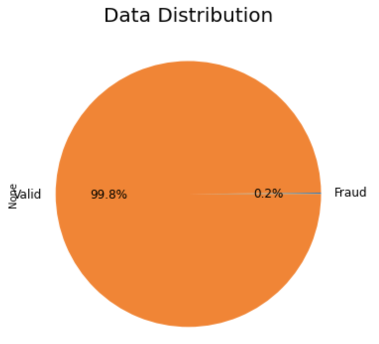

# 💳 CREDIT CARD FRAUD DETECTION
### Machine Learning

### ★ GOAL

Banks and credit card companies want to stop fraud from happening to their customers. As more and more people buy things online, it's important to have a good system in place to catch fraud. That's why working on a project to make their fraud detection better is important. 

The goal of this project is to make a system that can tell when someone is using a credit card fraudulently, so that the real card owner is not charged for something they didn't buy. The system uses regression and tensorflow models to look at the credit card data and figure out if there's something suspicious going on. Regression and Tensorflow approaches are utilized to analyze transaction data, identify patterns, and predict the likelihood of fraudulent activity.

By constantly checking credit card transactions as they happen, the system can quickly tell the bank or credit card company if something seems wrong. This helps protect the customer's money and keeps the whole financial system honest.

### ★ DATA INFORMATION

The dataset shows credit card transcations made by European cardholders in September 2013. It comprises of 284,807 entries all in numerical values and 31 columns. Original data features and other background information are not provided because of confidentiality concerns. 

The dataset has a significant class imbalance issue, where only a small fraction (around 0.2%) of the total instances, 473, are marked as fraud cases while the remaining 284,807 instances are non-fraud. This presents a challenge in accurately detecting fraud cases.

 
**Column Names and Description:**
 **Time** - this column includes the number of seconds that have passed between each transaction.
 **Amount** - this column includes the amount in the transaction.
 **V1-V28** - these columns includes all the confidential data transformed with PCA.
 **Class** - this is a binary representation of the fraudulent transactions where 1 means fraud and 0 means non-fraud.

### ★ DATA VISUALIZATION

<h4 align="center">Simple scatterplot of two columns</h4> 

<h4 align="center">Distribution of data per column</h4> 

### ★ TECHNIQUES OF HANDLING CLASS IMBALANCE IN THE DATASET:

### 👉 1. UNDERSAMPLING

Undersampling is a technique used to balance the class distribution of the dataset into decreasing the size of the dominant class (Valid or Non-Fraudalent). The technique randomly removes instances from the majority class until it reaches the same size as the minority class.

The dataset is balanced by randomly getting 473 samples from the Valid or Non-Fraudulent data to equalize our Fraud data.

#### *MACHINE LEARNING ALGORITHMS USED:*
  **⭐ Logistic Regression** 

Logistic Regression is a popular method for solving problems where you want to classify something as either "yes" or "no". It helps to understand the connection between different factors and the final outcome.

**MODEL ACCURACY: 91%**

  **⭐ Decision Tree** 

Decision Tree is one of many methods used to train a model. It works by breaking down a problem into smaller, easier decisions based on certain conditions. The final answer is found by making a series of decisions, each one based on the previous decision.

**MODEL ACCURACY: 89%** 

### UNDERSAMPLING CONCLUSION

Both logistic regression and decision tree were used for credit card fraud detection, with logistic regression having an accuracy of 91% and decision tree having 89%. The use of undersampling approach in logistic regression improved its performance compared to decision tree. The logistic approach benefits banks by improving security, efficiency and customer experience, and also benefits customers by reducing false alarms and improving the overall credit card usage experience.

### 👉 2. OVERSAMPLING

Oversampling is the opposite of undersampling. It involves duplicating instances from the minority class to balance the class distribution. This is done when there are too few examples of one type of item (minority class) in a dataset compared to another type (majority class). To balance the dataset, more examples of the minority class are added either by copying the existing ones or by making new ones. This helps make machine learning algorithms work better.

#### *MACHINE LEARNING ALGORITHMS USED:*
  **⭐ Logistic Regression** 
  **MODEL ACCURACY: 94%** 

  **⭐ TensorFlow** 

TensorFlow is a great option for data sets because it offers a lot of pre-made models and algorithms, including advanced deep learning models. Plus, it can train big models fast due to its ability to use GPUs for processing.

**MODEL ACCURACY: 93%** 

#### UNDERSAMPLING CONCLUSION

Logistic regression and a TensorFlow Keras model were used for credit card fraud detection with an accuracy of 94% and 93% respectively. The data was oversampled to address class imbalance, resulting in 99% more data than its original size. However, oversampling can lead to overfitting, making the model less effective in classifying new and unseen data where the model becomes too specialized to the training data, and fails to generalize well to new data.

The project highlights the need for ongoing monitoring and evaluation of fraud detection models. By combining undersampling and oversampling techniques, organizations can stay ahead of fraudsters and maintain the trust of their customers. This project emphasizes the crucial role that data preparation and appropriate techniques play in the success of predictive modeling in the field of credit card fraud detection.

